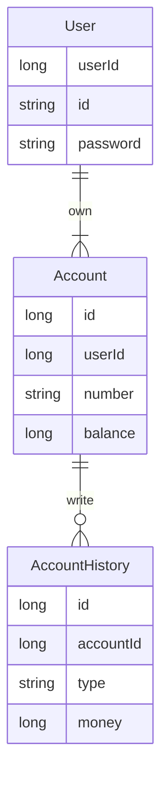
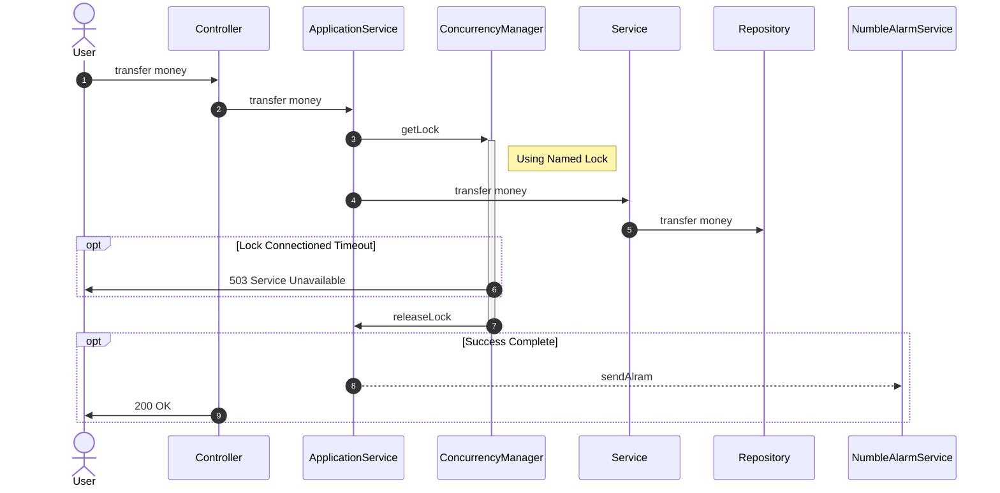

# numble-banking-api
Numble Challenge - Banking API

### Development Environment

- Back-End : Spring-Boot, Spring-Security, JPA, MySQL
- Cloud : AWS - RDS
- Infra : Docker
- Document : Rest Docs

### How to Build

1. execute docker docker
2. gradle build
3. http://localhost:8080/docs/index.html 접속

### Entity Relation Diagram

### Sequence Diagram

