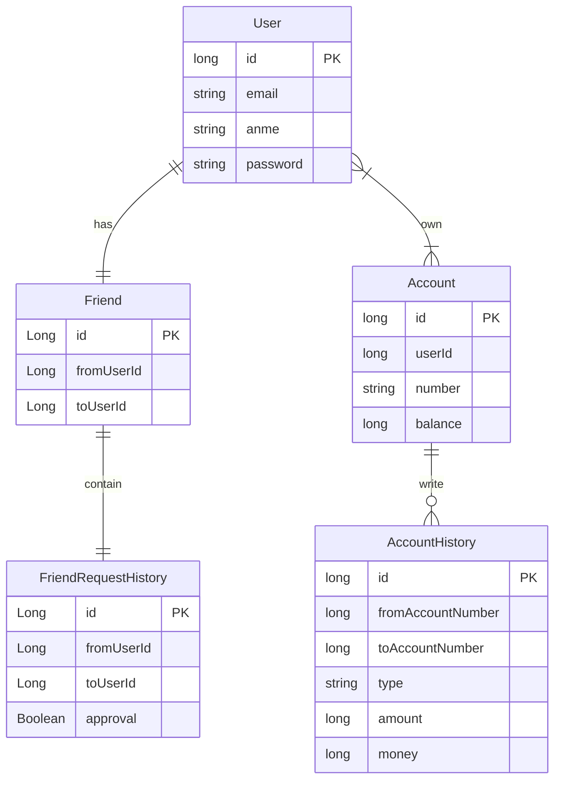
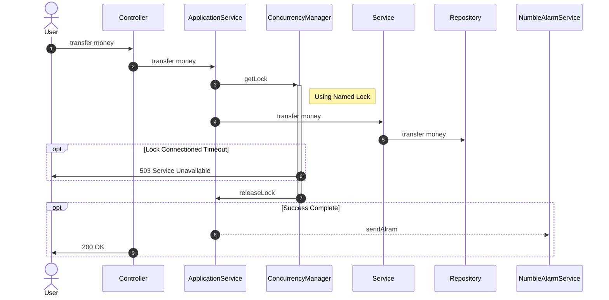

# numble-banking-api
Numble Challenge - Banking API

### 테스트

- 서버는 `run.sh` 를 실행하면 됩니다.

> 간혹 pinpoint-hbase 이 정상 실행하기 전에 pinpoint-collector 가 실행되어 apm 이 정상적으로 실행되지 않는 경우가 존재합니다. 이런 경우 collector를 재실행 해주세요.

- 테스트는 `test.sh` 를 실행하면 됩니다.

### Development Environment

- Back-End : Spring-Boot, Spring-Security, JPA, MySQL, Testcontainers
- Front-End : Thymeleaf
- Cloud : AWS - RDS
- Infra : Docker
- Document : Rest Docs

### How to Build

1. execute docker docker
2. install mysql 8.0 (read application-local.yml)
3. gradle build
4. gradle bootRun
5. http://localhost:8080/docs/index.html 접속

### Entity Relation Diagram

### Sequence Diagram

