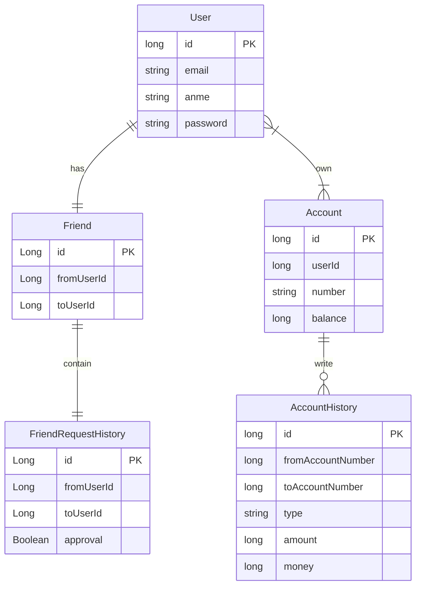
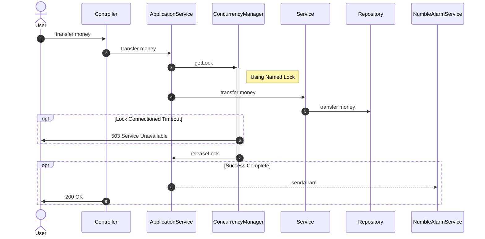

# numble-banking-api
Numble Challenge - Banking API

### API

https://this-is-spear.github.io/numble-banking-api/

### Development Environment

- Back-End : Spring-Boot, Spring-Security, JPA, MySQL, Testcontainers
- Fornt-End : Thymeleaf
- Cloud : AWS - RDS
- Infra : Docker
- Document : Rest Docs

### How to Build

1. execute docker docker
2. install mysql 8.0 (read application-local.yml)
3. gradle build
4. gradle bootRun
5. http://localhost:8080/docs/index.html 접속

### Entity Relation Diagram

### Sequence Diagram

